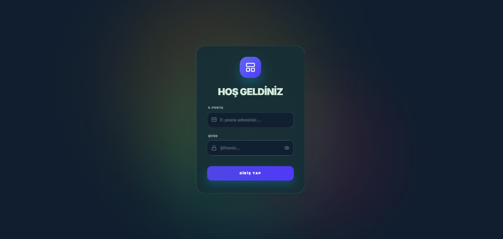
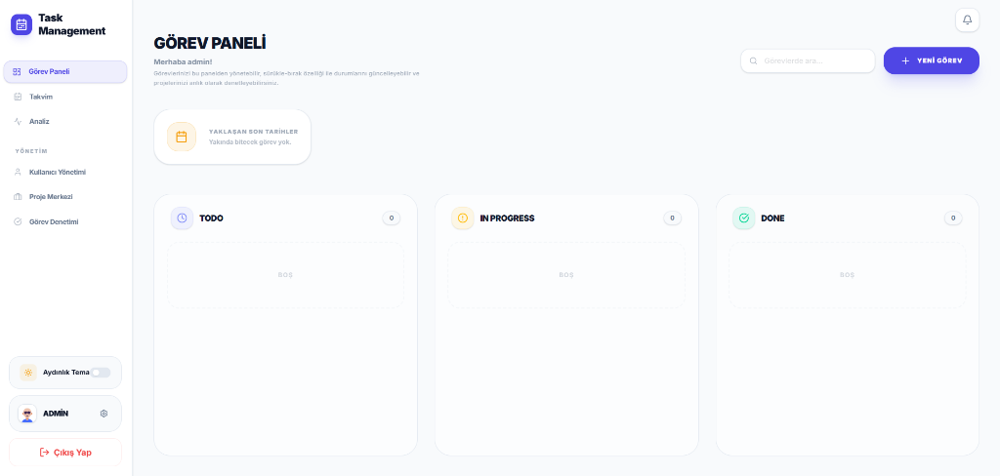
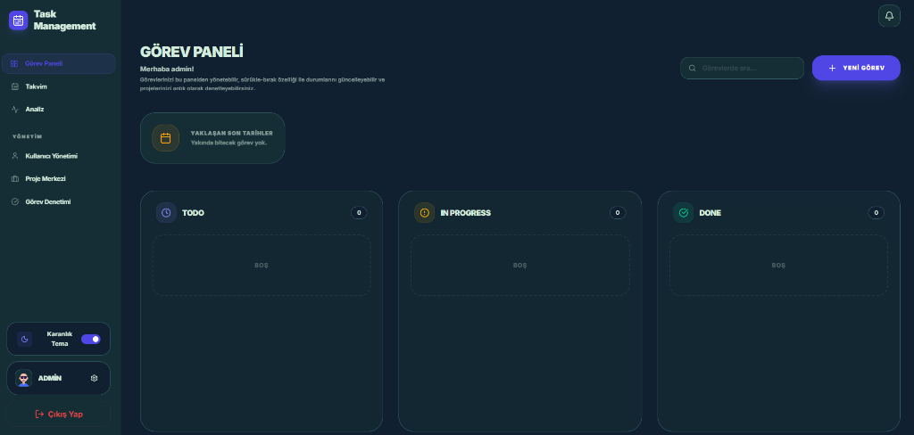
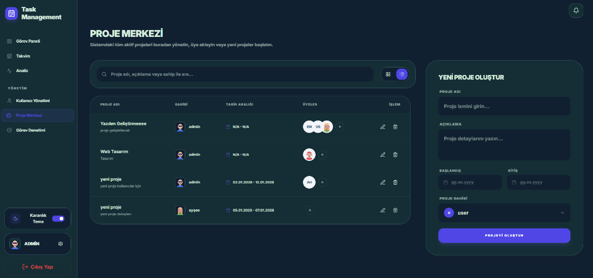
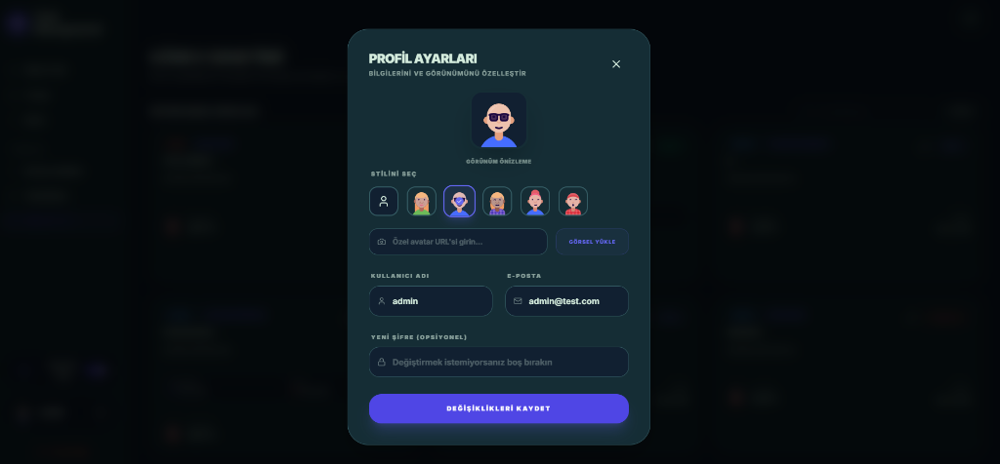

# Task Management 

Bu proje, bir organizasyon içindeki projelerin ve görevlerin Rol Bazlı Yetkilendirme (RBAC) prensipleriyle yönetilmesini sağlayan bir Full-Stack uygulamadır. Admin kullanıcıları tüm sistemi yönetirken, standart kullanıcılar sadece kendilerine atanan işleri görebilir.Uygulama, sadece görev takibi yapmakla kalmaz; verileri analiz ederek kullanıcı ve yöneticilere stratejik içgörüler sunar.

---

##  Özellikler

- ** Güvenli Kimlik Doğrulama:** JWT (JSON Web Token) tabanlı oturum yönetimi.
- ** Rol Bazlı Yetki (Admin/User):**
- ** Admin:** Kullanıcı oluşturma, proje tanımlama ve tüm görevleri izleme.
- ** User:** Kendine atanan projeleri görme, bu projeler altında görev oluşturma ve güncelleme.
- ** Görev Yönetimi:** Öncelik (Low, Medium, High) ve Durum (Todo, In Progress, Done) takibi.
- ** Gerçek Zamanlı Haberleşme: Socket.io entegrasyonu sayesinde bildirimler ve istatistik güncellemeleri sayfa yenilenmeden anlık olarak yansır.
- ** Akıcı Kanban Board: "Optimistic UI" yaklaşımı ile gecikmesiz sürükle-bırak görev yönetimi. 
- ** Gelişmiş Analiz Paneli: Recharts kütüphanesi ile modernize edilmiş, Admin ve User rollerine özel dinamik istatistik kartları ve grafikler.
---

##  Teknolojiler

- **Backend:** Node.js & Express ,PostgreSQL ,Socket.io,JWT & Bcrypt
- **Frontend:** React.js (Vite), Tailwind CSS v4, Axios, Context API ,Recharts & Framer Motion

---

## Versiyon Kontrolü
Proje, geliştirme sürecindeki bütünlüğü korumak ve tüm özellikleri eşzamanlı olarak test etmek amacıyla yerel aşamada tamamlanmış, ardından GitHub üzerine tek seferde "Final Versiyon" olarak yüklenmiştir.

---


##  Kurulum Adımları

Projeyi yerel bilgisayarınızda çalıştırmak için aşağıdaki adımları izleyin.

### 1. Ön Hazırlık
- Bilgisayarınızda **Node.js** yüklü olmalıdır.
- Bilgisayarınızda **PostgreSQL** yüklü ve çalışıyor olmalıdır.

### 2. Projeyi Klonlayın
```bash
git clone https://github.com/oguzhankaraburc/task-management.git
cd task-management
```

### 3. Backend Kurulumu
1. `backend` klasörüne girin:
   ```bash
   cd backend
   ```
2. Bağımlılıkları yükleyin:
   ```bash
   npm install
   ```
3. Bir `.env` dosyası oluşturun ve aşağıdaki bilgileri kendi PostgreSQL bilgilerinizle güncelleyin:
   ```env
   PORT=5000
   DB_NAME=task_management
   DB_USER=postgres
   DB_PASSWORD=sifreniz
   DB_HOST=127.0.0.1
   DB_DIALECT=postgres
   JWT_SECRET=ozel_bir_anahtar_girin
   ```
4. Veritabanını hazırlayın ve **Admin** kullanıcısını oluşturun (Bu komut tabloları otomatik oluşturur):
   ```bash
   node src/scripts/seedAdmin.js
   ```
5. Backend'i başlatın:
   ```bash
   npm run dev
   ```

### 4. Frontend Kurulumu
1. Yeni bir terminal açın ve `frontend` klasörüne girin:
   ```bash
   cd frontend
   ```
2. Bağımlılıkları yükleyin:
   ```bash
   npm install
   ```
3. Uygulamayı başlatın:
   ```bash
   npm run dev
   ```

---

##  Giriş Bilgileri (Varsayılan)

Seed script'ini çalıştırdıktan sonra şu bilgilerle giriş yaparak sistemi test edebilirsiniz:

- **Admin Girişi:**
  - Email: `admin@test.com`
  - Şifre: `admin123`

---

## Ekran Görüntüleri

| Giriş Ekranı (Karanlık) | Dashboard (Aydınlık) |
| :---: | :---: |
|  |  |

| Kanban Board (Karanlık) | Proje Merkezi |
| :---: | :---: |
|  |  |

| Profil Ayarları ve Özelleştirme |
| :---: |
|  |
